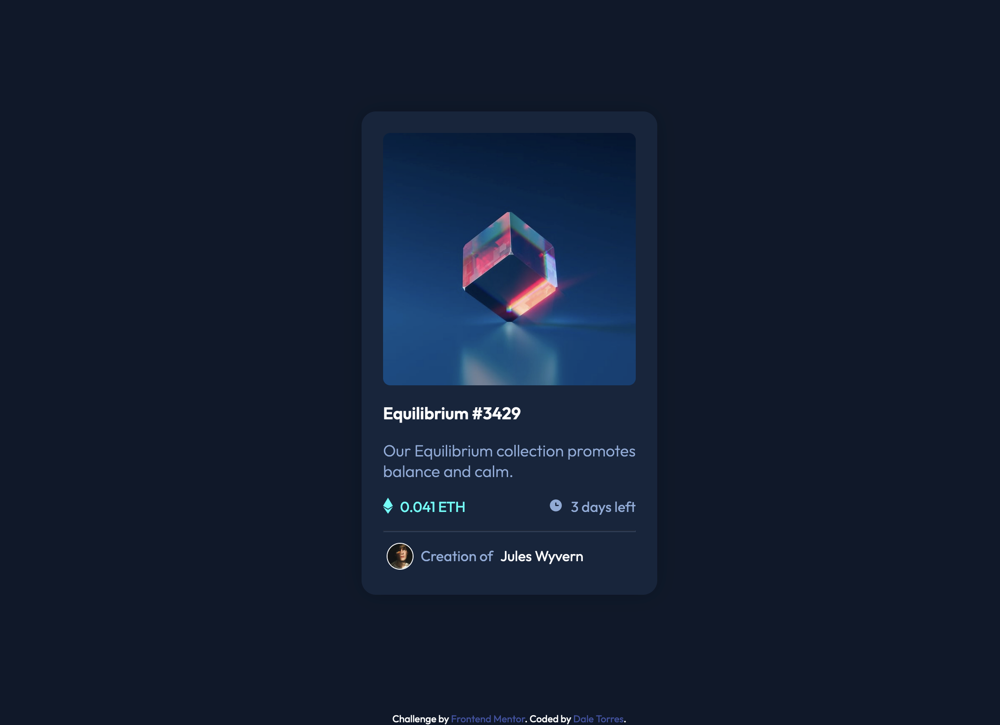
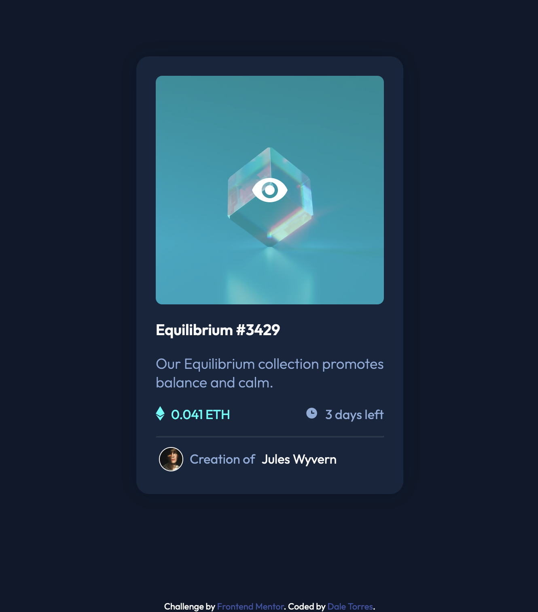
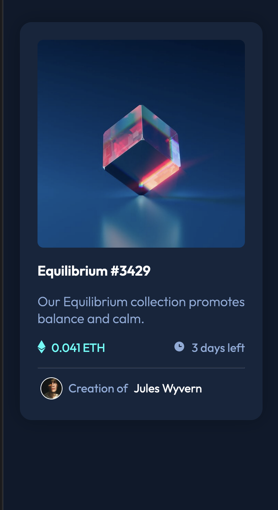

# Frontend Mentor - NFT preview card component solution

This is a solution to the [NFT preview card component challenge on Frontend Mentor](https://www.frontendmentor.io/challenges/nft-preview-card-component-SbdUL_w0U). Frontend Mentor challenges help you improve your coding skills by building realistic projects. 

## Table of contents

- [Overview](#overview)
  - [The challenge](#the-challenge)
  - [Screenshot](#screenshot)
  - [Links](#links)
- [My process](#my-process)
  - [Built with](#built-with)
  - [What I learned](#what-i-learned)
  - [Continued development](#continued-development)
- [Author](#author)
- [Acknowledgments](#acknowledgments)

**Note: Delete this note and update the table of contents based on what sections you keep.**

## Overview

### The challenge

Users should be able to:

- View the optimal layout depending on their device's screen size
- See hover states for interactive elements

### Screenshot

### Links

- Solution URL: [Add solution URL here](https://your-solution-url.com)
- Live Site URL: (https://github.com/daletorres/frontend-mentor-projects/tree/main/nft-preview-card-component-main)

## My process
 In this challenge, I tried using CSS variables and better HTML semantics compared to my previous challenges. I encountered an issue with the hover state over the image because the SVG icon was being affected by the opacity I set with the background which I later resolved by adding z-index.

### Built with

- Semantic HTML5 markup
- CSS custom properties
- Flexbox
- CSS Grid
- Mobile-first workflow

### What I learned

I learned how to add style to hover state with images albeit the approach I took may have been more complicated than it should be.

### Continued development

-CSS Variables
-HTML Semantics
-Hover states

## Author

- Frontend Mentor - [@daletorres](https://www.frontendmentor.io/profile/daletorres)

## Acknowledgments

Thanks to Kua Keith Liam for giving me insight on different approaches on how to solve the issue I encountered with the SVG icon.
