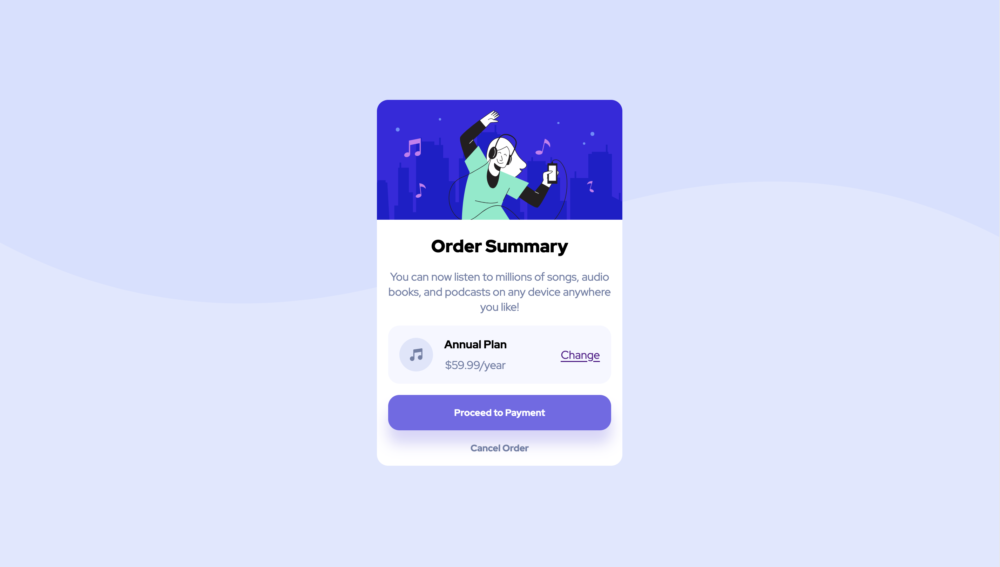
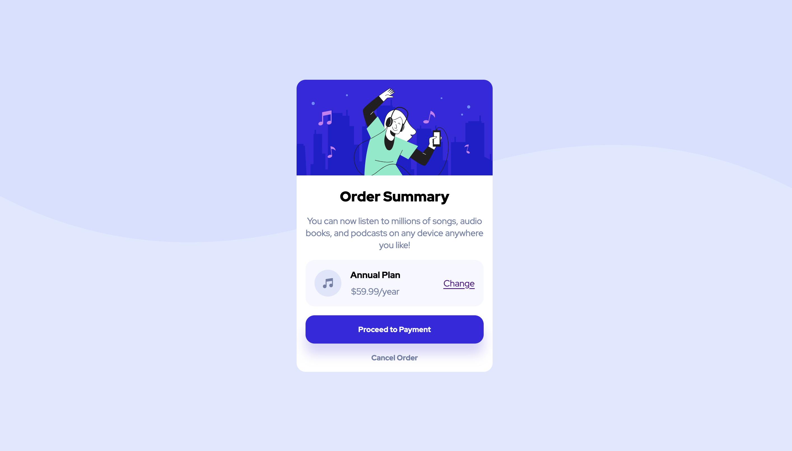

# Frontend Mentor - Order summary card solution

This is a solution to the [Order summary card challenge on Frontend Mentor](https://www.frontendmentor.io/challenges/order-summary-component-QlPmajDUj). Frontend Mentor challenges help you improve your coding skills by building realistic projects. 

## Table of contents

- [Overview](#overview)
  - [The challenge](#the-challenge)
  - [Screenshot](#screenshot)
  - [Links](#links)
  - [Built with](#built-with)
  - [What I learned](#what-i-learned)
  - [Continued development](#continued-development)
- [Author](#author)
## Overview

### The challenge

Users should be able to:

- See hover states for interactive elements

### Screenshot

### Links

- Solution URL: [Add solution URL here](https://your-solution-url.com)
- Live Site URL: https://daletorres.github.io/frontend-mentor-projects/order-summary-component-main/

### Built with

- Semantic HTML5 markup
- CSS custom properties
- Flexbox
- CSS Grid
- Mobile-first workflow

### What I learned

In this project I learned how to build the structure of more complex HTML and CSS compared to my previous works. I was able to practice and apply what I learned from previous challenges in order to finish this challenge faster and write cleaner code.

### Continued development

-Media queries
-width and min-width properties in CSS

## Author

- Frontend Mentor - [@daletorres](https://www.frontendmentor.io/profile/daletorres)
