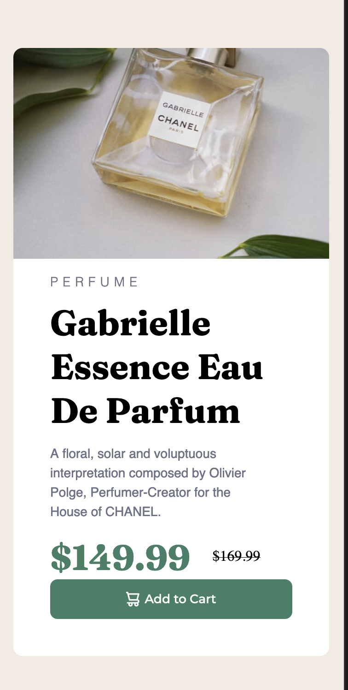

# Frontend Mentor - Product preview card component solution

This is a solution to the [Product preview card component challenge on Frontend Mentor](https://www.frontendmentor.io/challenges/product-preview-card-component-GO7UmttRfa). Frontend Mentor challenges help you improve your coding skills by building realistic projects. 

## Table of contents

- [Overview](#overview)
  - [The challenge](#the-challenge)
  - [Screenshot](#screenshot)
  - [Links](#links)
  - [Built with](#built-with)
  - [What I learned](#what-i-learned)
  - [Continued development](#continued-development)
- [Author](#author)
- [Acknowledgments](#acknowledgments)

## Overview

### The challenge

Users should be able to:

- View the optimal layout depending on their device's screen size
- See hover and focus states for interactive elements

### Screenshot

### Links

- Solution URL: [Add solution URL here](https://your-solution-url.com)
- Live Site URL: [Add live site URL here](https://your-live-site-url.com)

### Built with
- Semantic HTML5 markup
- CSS custom properties
- Flexbox
- Desktop-first workflow

### What I learned

In this project I learned how to optimize my CSS a little better compared to my first challenge, the results-summary-component, I was also
able to implement media queries better. Overall this project has reinforced and refreshed my learnings from The-Odin-Project as well as the previous challenge. Lastly, I used semantics in my HTML in this project instead of using just <divs>, albeit I am still not proficient with them.

### Continued development

-Media Queries.
-Flexbox.
-Possibly using Grid in the next few projects.
-HTML Semantics usage.

## Author
- Frontend Mentor - [@daletorres](https://www.frontendmentor.io/profile/daletorres)

## Acknowledgments

I was able to improve a lot with the help of @rohid99 on frontendmentor.io, he provided feedback on my first challenge and I was able to improve my workflow as well as write better code :) Thanks a lot Rohit.