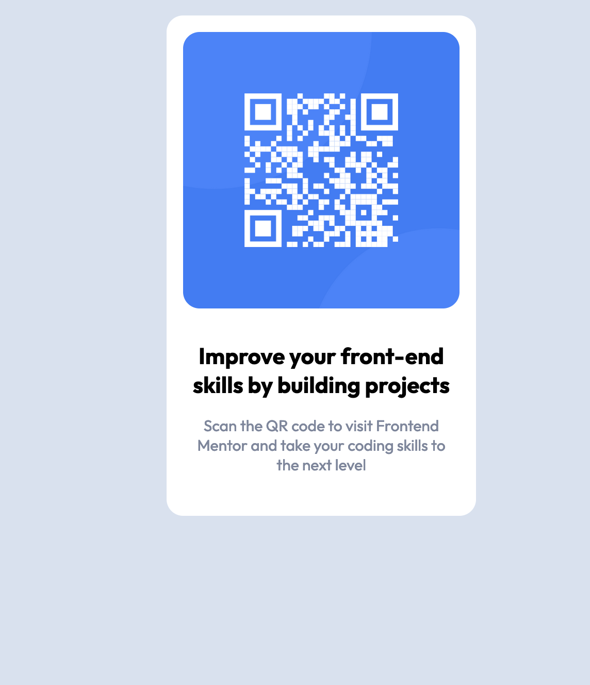

# Frontend Mentor - QR code component solution

This is a solution to the [QR code component challenge on Frontend Mentor](https://www.frontendmentor.io/challenges/qr-code-component-iux_sIO_H). Frontend Mentor challenges help you improve your coding skills by building realistic projects. 

## Table of contents

- [Overview](#overview)
  - [Screenshot](#screenshot)
  - [Links](#links)
- [My process](#my-process)
  - [Built with](#built-with)
  - [What I learned](#what-i-learned)
  - [Continued development](#continued-development)
- [Author](#author)

## Overview

### Screenshot
DESKTOP VIEW

MOBILE VIEW

### Links

- Solution URL: [Add solution URL here](https://your-solution-url.com)
- Live Site URL: [Add live site URL here](https://your-live-site-url.com)

## My process
  Since the project is simple, I tried going for a mobile-first workflow. 

### Built with

- Semantic HTML5 markup
- CSS custom properties
- Flexbox
- CSS Grid
- Mobile-first workflow

### What I learned

In this project I learned to use basic CSS variables, I also tried the mobile-first workflow and it seems that is easier for me to approach similar projects in this manner as well. 

### Continued development

-CSS variables
-Mobile first workflow

## Author
- Frontend Mentor - [@daletorres](https://www.frontendmentor.io/profile/daletorres)
